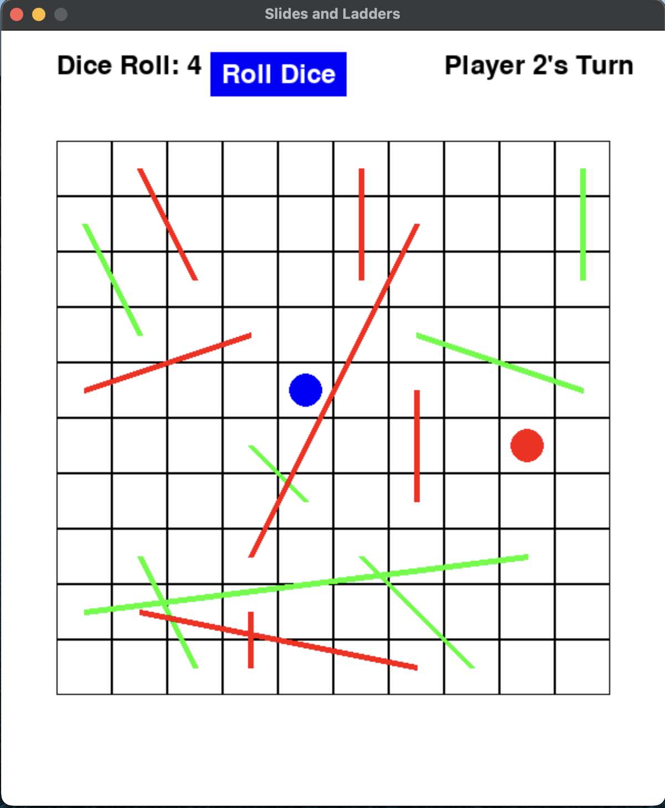

:warning: Everything between << >> needs to be replaced (remove << >> after replacing)

# << Project Title >>
## CS110 Final Project  << Semester, Year >>

## Team Members

Alessandro Berganza
***

## Project Description

My idea would be based on the general game concept of chutes and ladders, in which you and another person compete to be the first to reach the top. Moves would be decided using two dice. There would also be regular places on the boards, spots that make you go backward, spots that take you up using a ladder, and slides that make you go down. Possibly, I may include times when you need to play a mini-game(multiplication or trivia questions) to stay at a specific location or return to your previous spot. 

***    

## GUI Design

### Initial Design


### Final Design



## Program Design

### Features

1. Start Menu
2. Moveable Characters
3. Slides & Ladders
4. Mini Games
5. End Screen

### Classes

1.GameBoard - creates a game board with ladders and slides, and creates two six-sided dice
2.Player - creates two players to battle it out

## ATP

- Step 1: Start Game
Test Description: Test that the game can be commenced 
  - Open terminal, got to project folder, type:
    - ```py
      python3 main.py
      ```
    - Click on start button
    - Verfity that this option leads to the expected outcome 
  - **Expected Outcome**
    - Character appears in the first/beginning square of the board game screen

- Step 2: Game Finished 
Test Description: Confirm that when a player reaches the end, that player has won 
- Start the game
    - Play until a player has reached the last square
    - Verify that the game displays which player has won(player 1 or player 2)
  - **Expected Outcome**
    - The game should display which player has won(player 1 or player 2)

- Step 3: Instructions Menu 
Test Description: Test that the instructions option can be navigated
- Open terminal, got to project folder, type:
    - ```py
      python3 main.py
      ```
      - Click the Instructions option 
      - Verify that this option leads to the expected outcome 
  - **Expected Outcome**
    - The menu should display instructions about the game & a key denonting what each of the colored lines does

- Step 4: Roll Dice 
Test Description: Test that the roll die option works and moves the player that ammount of squares
- Start the game
    - During each player's turn in order to traverse the board they need to role a die
        - This is accomplished by clicking the Roll Die option 
        - Verify that the Role Die option moves each player respectively
  - **Expected Outcome**
    - The number that is rolled by the die should move the player that amount of squares

- Step 5: Slides & Ladders
Test Description: Verify that the slides and ladders work properly
- Start the game
    - During each player's turn they have the opportunity to either land on a slide or ladder
        - This is accomplished by landing on the exact square
            - Red lines: landing on the square where the top of the line commences 
            - Green lines: landing on the square where the bottom of the line commences
        - Verify that the slides and ladders serve their intended purpose 
  - **Expected Outcome**
    - The red lines should slide the player to the end of that line, while the green lines should climb the player to the end of that line

